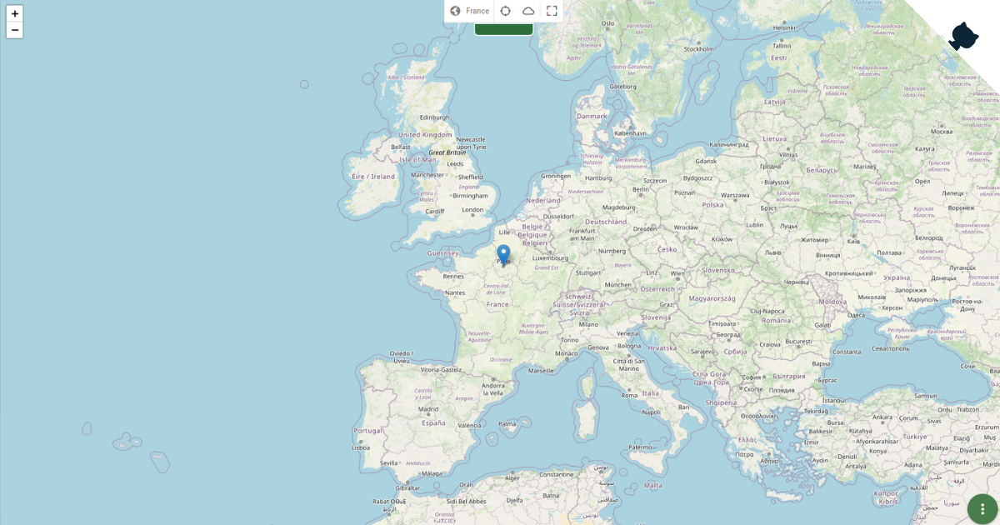

<div align="center">
  
  <h1>Feathers Quasar Boilerplate</h1>
  
  

  <p>
    <a href="https://codeclimate.com/github/tristan-greffe/feathers-quasar-boilerplate">
      
    </a>
    <a href="https://github.com/tristan-greffe/feathers-quasar-boilerplate/stargazers">
      
    </a>
    <a href="https://github.com/tristan-greffe/feathers-quasar-boilerplate/blob/master/LICENSE">
      
    </a>
  </p>

 <h4>
    <a href="https://github.com/tristan-greffe/feathers-quasar-boilerplate/issues/">Report Bug</a>
    <span> · </span>
    <a href="https://github.com/tristan-greffe/feathers-quasar-boilerplate/issues/">Request Feature</a>
  </h4>

</div>

## About the Project

<div align="center">
  
</div>

This boilerplate, inspired by [Kalisio](https://github.com/kalisio), is an application based on the **[FeathersJS](https://feathersjs.com/)** & **[QuasarJS](https://quasar.dev/)** frameworks for visualizing weather data in real time.

### Tech Stack

[](https://skillicons.dev)

### Features

1. Weather data visualization with [OpenWeathers](https://openweathermap.org/)

2. Interactive map: the interactive map is based on [Leaflet](https://leafletjs.com/), a powerful mapping framework.

3. Full authentication with [feathers-authentication-management](https://feathers-a-m.netlify.app/)

## Getting Started

### Step 1: set the required environment variables

| ENV | Description | Required |
|---|---|---|
| `GMAIL_USER` | Email used for gmail account | yes |
| `GMAIL_PASWORD` |  Password for gmail account | yes |
| `GOOGLE_CLIENT_ID` | Customer ID for google authentication | no |
| `GOOGLE_CLIENT_SECRET` | Customer secret key for google authentication | no |

### Step 2: installing

#### From source code

```sh
git clone https://github.com/tristan-greffe/feathers-quasar-boilerplate.git

// Run the server/API
cd feathers-quasar-boilerplate/api
yarn install
yarn dev

// In another terminal run the client app
cd feathers-quasar-boilerplate
yarn install
yarn dev
```

> [!NOTE]
> Then point your browser to localhost:8080

#### Using Docker

```bash
// Retrieve the latest available dev tag
docker pull codask/feathers-quasar-boilerplate:dev

// Run the MongoDB and feathers-quasar-boilerplate containers
docker-compose up -d

// Stop the MongoDB and feathers-quasar-boilerplate containers
docker-compose down

// Stop the MongoDB and feathers-quasar-boilerplate containers erasing DB data
docker-compose down -v
```

https://github.com/tristan-greffe/feathers-quasar-boilerplate/blob/26a862bf54163d6cadf90ee97f37f36ea01d5c60/readme_assets/docker-compose.yml#L1-L26

> [!NOTE]
> Then point your browser to localhost:8081

### Testing

#### API
From the root folder run the server-side tests:

```sh
$yarn test:server
```

> [!IMPORTANT]
> To run the server-side tests, the server must not be running.

#### Client
From the root folder run the client-side tests:

```sh
$yarn test:client
```

> [!IMPORTANT]
> To run the client-side tests, you must first run the web app.

## Contributing

Contributions are always welcome!

Contributions are what make the open source community such an amazing place to learn, inspire, and create. Any contributions you make are **greatly appreciated**.

If you have a suggestion that would make this better, please fork the repo and create a pull request. You can also simply open an issue with the tag "enhancement".
Don't forget to give the project a star! Thanks again!

1. Fork it! 🤙

2. Create your feature branch: `git checkout -b my-new-feature`

3. Commit your changes: `git commit -m "Add some feature"`

4. Push to the branch: `git push origin my-new-feature`

5. Submit a pull request 👍

## License

This project is licensed under the MIT License - see the [license file](./LICENSE) for details
